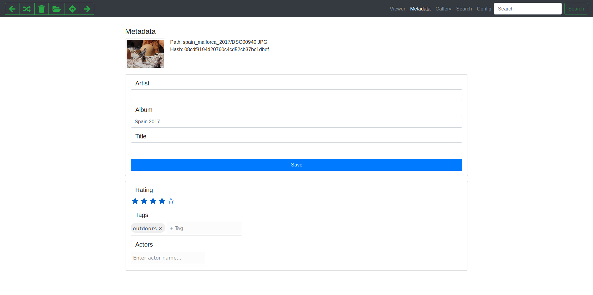

# Media viewer and organiser

## Features
* Web-based interface
* Video, gif and image support
* Tagging media
* Various forms of searching (weighted keyword, tag selection, expression)
* Metadata support for Artist/Album/Title
* Auto-scraped metadata from files where possible
* Internal image gallery for faster browser
* Thumbnail generation for all media
* Auto-transcode videos for web-browser compatibility
* Electron support

## Notes
* Requires ffmpeg for transcoding and thumbnails (included). Requires graphicsmagick for extracting EXIF data.
* Caching data takes a lot of space. All videos are re-transcoded to be h264 and HLS compatible.
* Because of pre-caching it's possible to quickly skip through videos and loading times are minimal.
* All videos are transcoded to a high-quality, if the source video is h264 it's just copied. Often this means h264 source videos are transcoded quickly but it also means a reasonably fast network is required.
* Tested on Ubuntu 16.04 & 18.04 64-bit and Windows 10 64-bit.

## Setup
On Ubuntu/Debian run:
sudo apt-get install graphicsmagick

For Windows install graphicsmagick.

### As a server
`npm install --production && npm run server`

### As an Electron app
`npm install && npm run postinstall && npm run electron`

Or to create binaries run:
`npm install && npm run dist`

## Running
Specifying a path as the last argument when doing any launch will set the config to be used by the instance.
Such as: `npm run start /data/Pictures/config.json`.
Doing this allows multiple libraries to be acessed, if it's not specified a default config.json is created in the application directory.

## Screenshots

